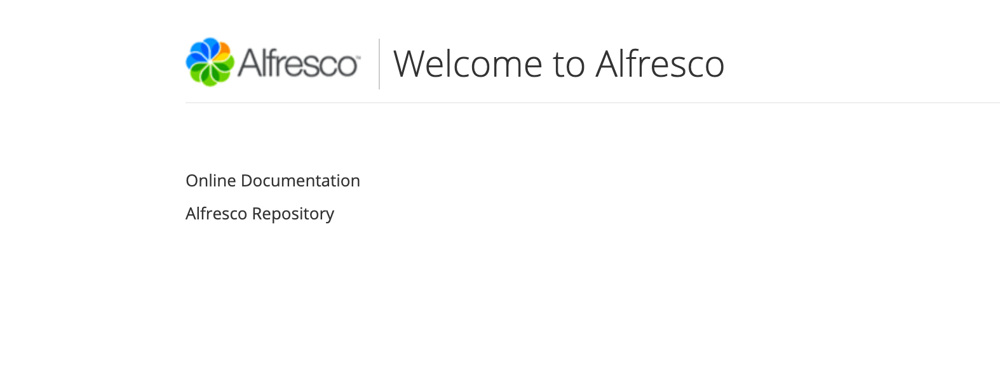
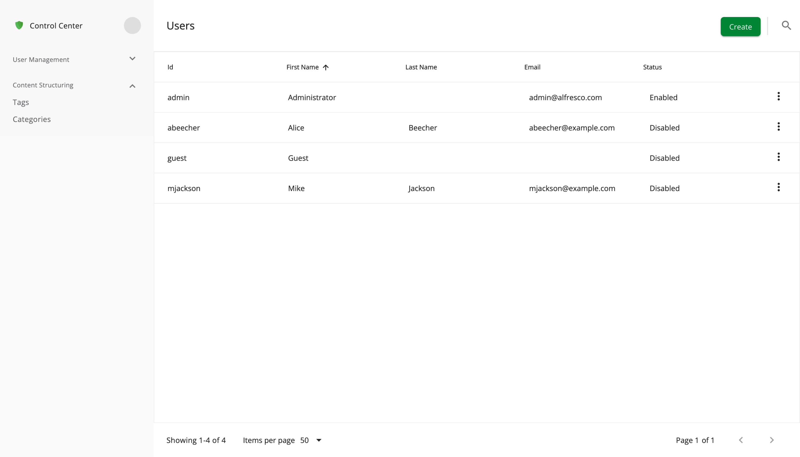
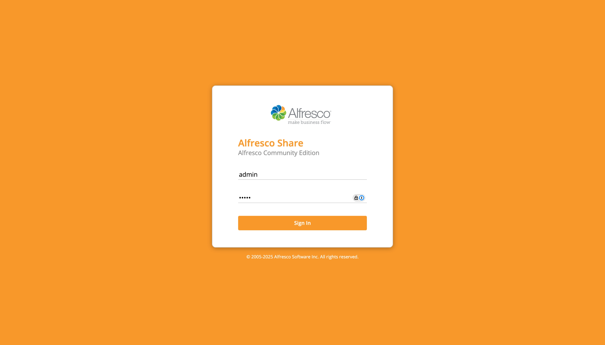
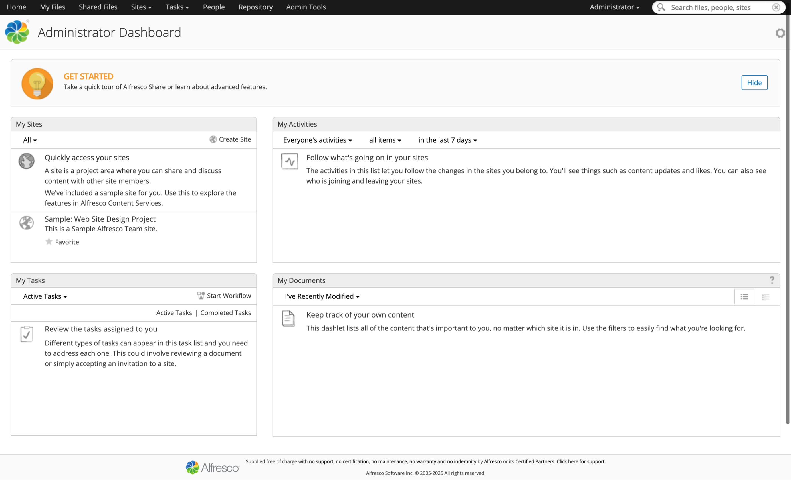
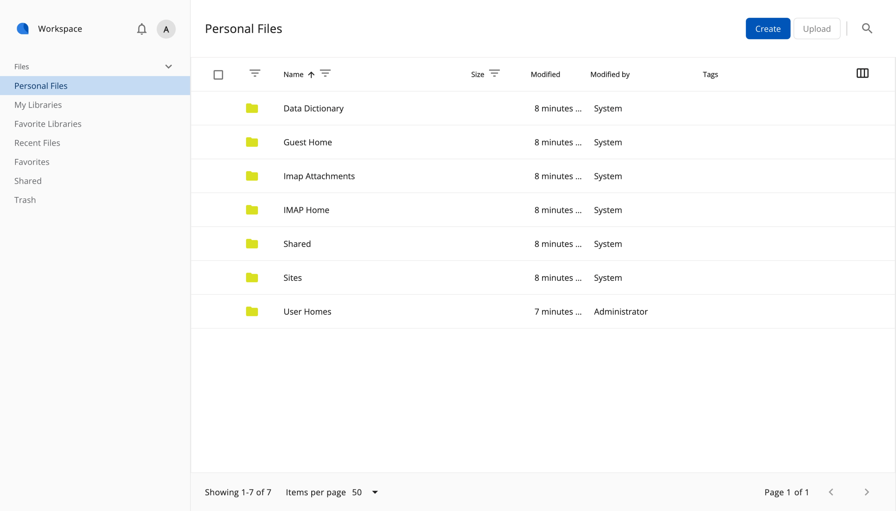
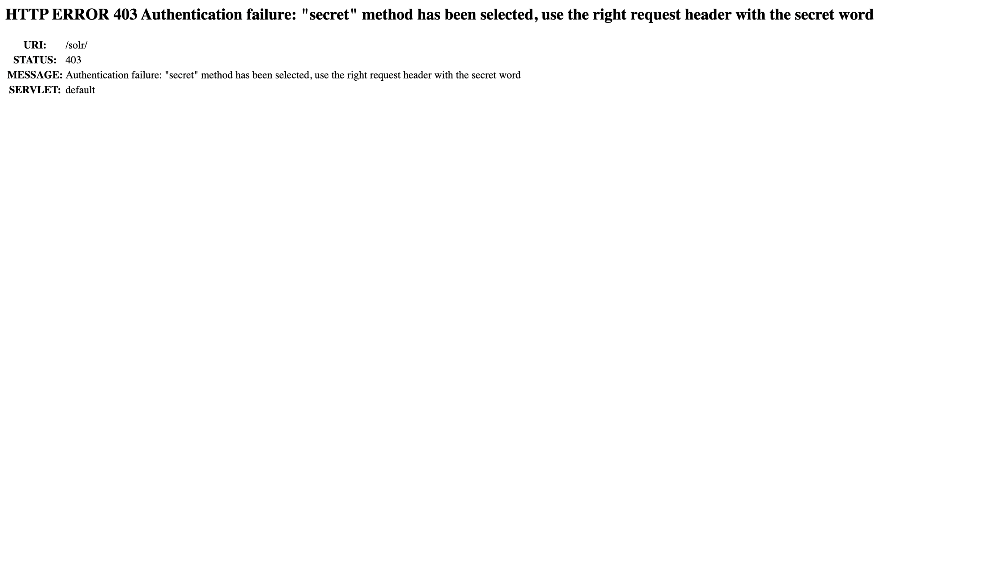
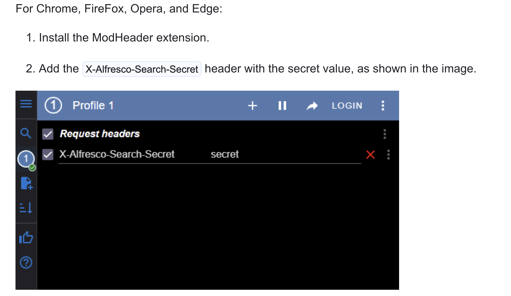
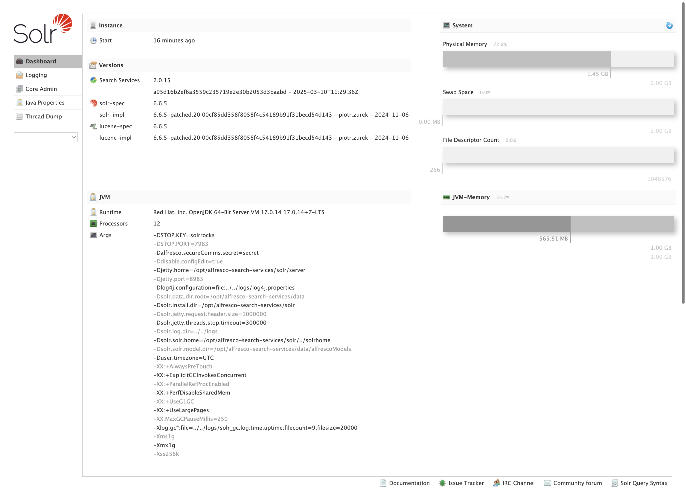
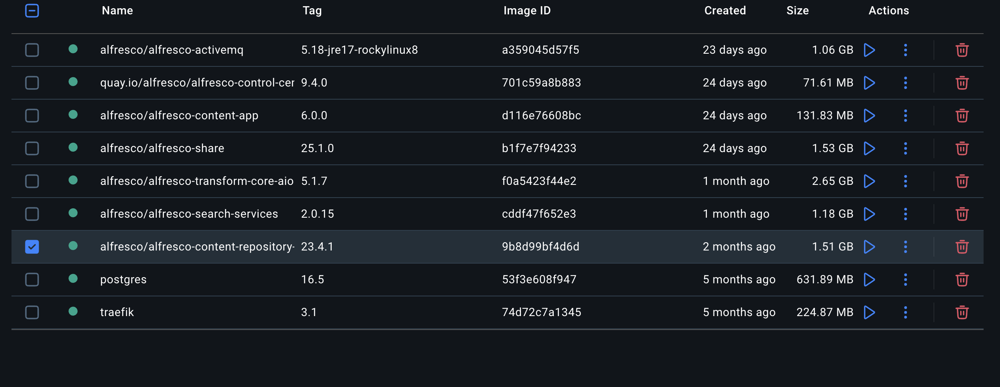

# What to choose.
1. go in docker-compose folder
2. launch the community compose 
   ```bash
     docker-compose -f community-compose.yaml up

   ```
  
    Open your browser and check everything starts up correctly:

    Administration and REST API  http://localhost:8080/
    


    alfresco Control Center	 http://localhost:8080/admin
    

    Share	http://localhost:8080/share
    
    

    Alfresco Content App	http://localhost:8080/content-app
    

    Search Services administration	http://localhost:8083/solr
    
    
    
    after we set the header we reload and see the solr dashboard.
3. List of container
   
[details on images and docker](https://docs.alfresco.com/content-services/community/install/containers/docker-compose/#:~:text=Verify%20that%20all%20the%20services%20started%20correctly.)

Logs:
 ```bash
docker-compose logs <service-name>

docker container logs <container-name>

docker-compose logs --tail=25 share
docker container logs --tail=25 docker-compose-share-1

```

***To modify your development environment, for example to change or mount files in the existing images, you’ll have to create new custom Docker images (recommended approach). The same approach applies if you want to install AMP files into the repository and Share images. See the Customization guidelines for more.
***
